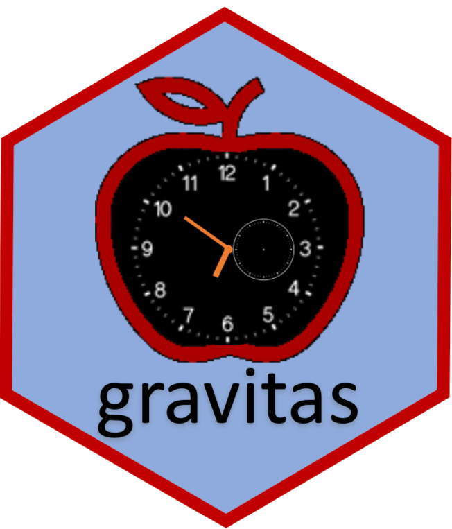

<!-- README.md is generated from README.Rmd. Please edit that file -->

```{r, include = FALSE, message = FALSE, warning = FALSE}
knitr::opts_chunk$set(
  collapse = TRUE,
  comment = "#>",
  fig.path = "man/figures/README-",
  out.width = "100%"
) 

```

<!-- badges: start -->

# gravitas 

[](https://travis-ci.org/Sayani07/gravitas)
[](https://ci.appveyor.com/project/Sayani07/gravitas)
[](https://codecov.io/gh/Sayani07/gravitas?branch=master)
[](https://cran.r-project.org/package=gravitas)


<!-- badges: end -->

## Overview

Several classes of time deconstructions exist, resulting in alternative data segmentation and, as a result, different visualizations that can aid in the identification of underlying patterns. Cyclic granularities is one form of time deconstruction (like hour of the day, day of the week, or special holidays) that can be used to create a visualization of the data to explore for periodicities, associations, and anomalies. Package `gravitas` provides a tool to examine the probability distribution of univariate time series across bivariate cyclic granularities using a range of graphics in `ggplot2` through the following:  

 - create multiple-order-up cyclic temporal granularities.  
 
 - categorize pairs of granularities as either  *harmony* or *clash*, where harmonies are pairs of granularities that aid exploratory data analysis, and clashes are pairs that are incompatible with each other for exploratory analysis.  
 
 - recommending appropriate probability distribution plots of the time series variable across the bivariate cyclic granularities based on the levels of the granularities and their interaction.  

`gravitas` is not restricted to temporal data. It can be utilized in non-temporal 
cases for which a hierarchical structure can be construed similar to time.
The hierarchical structure of time creates a natural nested ordering. For example, hours are nested within days, days within weeks, weeks within months, and so on. Similarly, if a periodic nesting exists for a non-temporal application, `gravitas` can be used to explore the probability distribution of a continuous random variable. 

## Installation

You can install gravitas from CRAN:
  
```{r, eval = FALSE}
install.packages("gravitas")  
```

You can install the development version from [GitHub](https://github.com/) with:

```{r, eval=FALSE}
# install.packages("devtools")
devtools::install_github("Sayani07/gravitas")

```
## Quick look

`gravitas` comes with an interactive webpage, which lets you go through the different functionalities of this package. To try it, simply use gravitas::run_app().


## Features

  - Search for a set of all possible temporal granularities with `search_gran()`
  
  - Build any temporal granularity with `create_gran()` 
  
  - Check if two temporal granularities are harmonies with `is_harmony()`
 
  - Get all possible harmonies with `harmony()`
 
  - Get recommendations on choosing more appropriate distribution plots and advice on the interaction between granularities, number of observations available for drawing probability distributions for chosen granularities with `gran_advice()`
  
  - Validate if the created granularity matches your already existing column with `validate_gran()`
  
  - Explore probability distribution across bivariate temporal granularities with `prob_plot()`
    
## Example: temporal case

The probability distribution of energy consumption for ten households from 
[customer trials](https://data.gov.au/dataset/ds-dga-4e21dea3-9b87-4610-94c7-15a8a77907ef/details?q=smart-meter) can be explored as follows:

_Search for granularities_

```{r, message=FALSE}
library(gravitas)
library(dplyr)
library(ggplot2)
library(lvplot)
library(ggpubr)

 smart_meter10 %>%
   search_gran(highest_unit = "week")
```

_Screen harmonies from the search list_

```{r, message=FALSE}
 smart_meter10 %>%
   harmony(
     ugran = "day",
     filter_in = "wknd_wday"
   )
``` 

_Visualize probability distribution of the harmony pair (wknd_wday, hour_day)_

Energy consumption of a single customer shown with different distribution displays, and granularity arrangements: hour of the day; and weekday/weekend. **a** The side-by-side boxplots make the comparison between day types easier, and suggest that there is generally lower energy use on the weekend. Interestingly, this is the opposite to what might be expected. Plots **b**, **c** examine the temporal trend of consumption over the course of a day, separately for the type of day. The area quantile emphasizes time, and indicates that median consumption shows prolonged high usage in the morning on weekdays. The violin plot emphasizes subtler distributional differences across hours: morning use is bimodal.

 
```{r probplot, message=FALSE} 
cust2_quantile <- smart_meter10 %>%
  filter(customer_id %in% c(10017936)) %>%
  prob_plot(
    "wknd_wday", "hour_day",
    response = "general_supply_kwh",
    plot_type = "quantile",
    symmetric = TRUE,
    quantile_prob = c(0.01, 0.1, 0.25, 0.5, 0.75, 0.9, 0.99)
  ) +
  scale_y_sqrt() +
  ylab("") +
  # ylab("electricity demand [KWh]") +
  xlab("hours of the day") +
  ggtitle("") +
  theme_minimal() +
  theme(panel.border = element_rect(colour = "#E0E0E0", fill = NA)
  )

cust2_violin <- smart_meter10 %>%
  filter(customer_id %in% c(10017936)) %>%
  prob_plot(
    "wknd_wday",  "hour_day",
    response = "general_supply_kwh",
    plot_type = "violin"
  ) +
  scale_y_sqrt() +
  ylab("") +
  xlab("hours of the day") +
  ggtitle("") +
  scale_x_discrete(breaks = seq(0, 23, 5)) +
  theme_minimal() +
  theme(panel.border = element_rect(colour = "#E0E0E0", fill = NA)
  )

cust2_box <- smart_meter10 %>%
  filter(customer_id %in% c(10017936)) %>%
  prob_plot(
    "hour_day", "wknd_wday",
    response = "general_supply_kwh",
    plot_type = "boxplot"
  ) +
  xlab("") +
  ylab("") +
  ggtitle("") +
  scale_x_discrete(labels = c("wday", "wend")) +
  scale_y_sqrt() +
  theme(axis.text.x = element_text(size = 7)) +
  theme_minimal() +
 theme(panel.border = element_rect(colour = "#E0E0E0", fill = NA)
)

gg_fig <- ggarrange(
  cust2_box,
  ggarrange(
    cust2_quantile, cust2_violin,
    nrow = 2, labels = c("b", "c")
  ),
  ncol = 2, labels = "a"
)

gg_fig %>%
  annotate_figure(
  left = text_grob("electricity demand [KWh]", rot = 90)
)

```    

## Example: non-temporal case

`cricket` data set in the package can be explored by explicitly defining a hierarchy table as follows:


```{r cricketread}
library(tsibble)
cricket_tsibble <- cricket %>%
 dplyr::mutate(data_index = row_number()) %>%
 as_tsibble(index = data_index)

 hierarchy_model <- tibble::tibble(
   units = c("index", "ball", "over", "inning", "match"),
   convert_fct = c(1, 6, 20, 2, 1)
 )
 cricket_tsibble %>% 
   create_gran(
     "over_inning",
     hierarchy_model
   )
```


_Visualize granularities for non-temporal data_

Letter value plot of total runs per over is shown overs of the innings (x-axis) and innings of the match (facet). It can be observed that there is no clear upward shift in runs in the second innings as compared to the first innings. The variability in runs increases as the teams approach towards the end of the innings, as observed through the longer and more distinct letter values.

```{r cricket}

   cricket_tsibble %>%
   filter(batting_team %in% c("Mumbai Indians",
                              "Chennai Super Kings"))%>%
   prob_plot("inning", "over",
   hierarchy_model,
   response = "runs_per_over",
   plot_type = "lv")
```

## More information

View the [vignette](https://sayani07.github.io/gravitas/) to get started! 

This package takes tsibble as the data input. Tsibble provides a data class of tbl_ts to represent tidy temporal data. It consists of a time index, key and other measured variables in a data-centric format, which makes it easier to work with temporal data. To learn more about it, please visit [https://tsibble.tidyverts.org/](https://tsibble.tidyverts.org/)

## Acknowledgements

Thanks to PhD supervisors [Prof. Rob J Hyndman](https://robjhyndman.com/), [Prof. Dianne Cook](http://dicook.org/) and [Google Summer of Code 2019](https://summerofcode.withgoogle.com/) mentor [Prof. Antony Unwin](http://rosuda.org/~unwin/) for their support and always leading by example. The fine balance of encouraging me to work on my ideas and stepping in to help when I need has made the development of this package a great learning experience for me.

Moreover, I want to thank my cohort at [NUMBATS](https://www.monash.edu/news/articles/team-profile-monash-business-analytics-team), Monash University, especially [Mitchell O'Hara-Wild](https://www.mitchelloharawild.com/) and [Nicholas Spyrison](https://github.com/nspyrison) for always lending an ear and sharing their wisdom and experience of developing R packages, with such kindness. 


## Reporting and issues
Please submit all bug reports, errors, and feature requests to https://github.com/Sayani07/gravitas/issues


