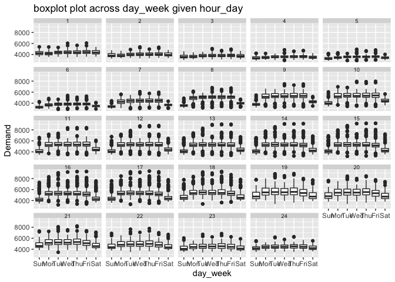
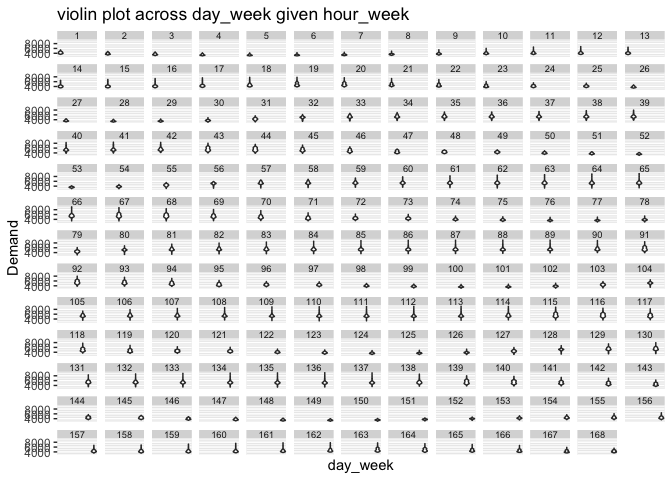

<!-- README.md is generated from README.Rmd. Please edit that file -->

# gravitas

<!-- badges: start -->

[](https://travis-ci.org/Sayani07/gravitas)
<!-- badges: end -->

The package **gravitas** provides a tool to examine the probability
distribution of univariate time series across bivariate temporal
granularities using range of graphics in `ggplot2` through the
following:

  - create multiple-order-up circular or aperiodic temporal
    granularities.

  - categorize pairs of granularities as either *harmony* or *clash*,
    where harmonies are pairs of granularities that aid exploratory data
    analysis, and clashes are pairs that are incompatible with each
    other for exploratory analysis.

  - recommending appropriate probability distribution plots of the time
    series variable across the bivariate granularities based on the
    levels of the bivariate granularties and their compatibility
    relationship.

## Installation

<!-- You can install the released version of gravitas from [CRAN](https://CRAN.R-project.org) with: -->

<!-- ``` r -->

<!-- install.packages("gravitas") -->

<!-- ``` -->

You can install the development version from
[GitHub](https://github.com/) with:

``` r
# install.packages("devtools")
devtools::install_github("Sayani07/gravitas")
```

## Quick look

gravitas comes with an interactive webpage, which lets you go through
the different functionalities of this package. To try it, simply use
gravitas::run\_app().

## Get started

The `vic_elec` data from tsibbledata package is employed to have a run
through of this package. It is a half-hourly tsibble consisting of half
hour demand for the state of Victoria. Suppose it is of interest to to
examine how the univariate series `Demand` varies with different
deconstructions of time.

``` r
library(gravitas)
library(dplyr)
#> 
#> Attaching package: 'dplyr'
#> The following objects are masked from 'package:stats':
#> 
#>     filter, lag
#> The following objects are masked from 'package:base':
#> 
#>     intersect, setdiff, setequal, union
tsibbledata::vic_elec %>% search_gran()
#>  [1] "hhour_hour"         "hhour_day"          "hhour_week"        
#>  [4] "hhour_fortnight"    "hhour_month"        "hhour_quarter"     
#>  [7] "hhour_semester"     "hhour_year"         "hour_day"          
#> [10] "hour_week"          "hour_fortnight"     "hour_month"        
#> [13] "hour_quarter"       "hour_semester"      "hour_year"         
#> [16] "day_week"           "day_fortnight"      "day_month"         
#> [19] "day_quarter"        "day_semester"       "day_year"          
#> [22] "week_fortnight"     "week_month"         "week_quarter"      
#> [25] "week_semester"      "week_year"          "fortnight_month"   
#> [28] "fortnight_quarter"  "fortnight_semester" "fortnight_year"    
#> [31] "month_quarter"      "month_semester"     "month_year"        
#> [34] "quarter_semester"   "quarter_year"       "semester_year"
```

The default for search gran in this case, provides temporal
granularities ranging from half-hour to year. If these options are
considered too many, the default options can be modified to limit the
possibilities. For example, the most coarce temporal unit can be set to
be “month”.

``` r
library(gravitas)
library(dplyr)
tsibbledata::vic_elec %>% search_gran(ugran = "month")
#>  [1] "hhour_hour"      "hhour_day"       "hhour_week"     
#>  [4] "hhour_fortnight" "hhour_month"     "hour_day"       
#>  [7] "hour_week"       "hour_fortnight"  "hour_month"     
#> [10] "day_week"        "day_fortnight"   "day_month"      
#> [13] "week_fortnight"  "week_month"      "fortnight_month"
```

This looks better. However, some intermediate temporal units might not
be pertinent to the analysis and we might want to remove them from the
list of granularities that we want to examine.

``` r
library(gravitas)
library(dplyr)
tsibbledata::vic_elec %>% search_gran(ugran = "month", filter_out = c("fortnight"))
#>  [1] "hhour_hour"  "hhour_day"   "hhour_week"  "hhour_month" "hour_day"   
#>  [6] "hour_week"   "hour_month"  "day_week"    "day_month"   "week_month"
```

Now that we have the list of granularities that we want to look at, let
us see which pairs form harmony/clash.

``` r
library(gravitas)
library(dplyr)
tsibbledata::vic_elec %>% is.harmony(gran1 = "hhour_week", gran2 ="day_week")
#> [1] "FALSE"

tsibbledata::vic_elec %>% is.harmony(gran1 = "hour_day", gran2 ="day_week")
#> [1] "TRUE"

tsibbledata::vic_elec %>% is.harmony(gran1 = "day_month", gran2 ="hhour_week")
#> [1] "TRUE"
```

Or, we can find the set of harmonies all at once with the help of
function
`harmony`.

``` r
tsibbledata::vic_elec %>% harmony(ugran = "month", filter_out = c("fortnight", "hhour")) 
#> # A tibble: 10 x 2
#>    granularity1 granularity2
#>    <fct>        <fct>       
#>  1 hour_day     day_week    
#>  2 hour_day     day_month   
#>  3 hour_day     week_month  
#>  4 day_week     hour_day    
#>  5 day_week     day_month   
#>  6 day_week     week_month  
#>  7 day_month    hour_day    
#>  8 day_month    day_week    
#>  9 week_month   hour_day    
#> 10 week_month   day_week
```

Now, we want to view distribution of `Demand` across these bivariate
granularities through boxplots using
`granplot`.

``` r
tsibbledata::vic_elec %>% granplot("hour_day", "day_week", "Demand", plot_type = "boxplot")
```

 Now, we
want to view distribution of \`Demand’ across the next set of harmonies
- hour\_day and day\_month and let the package decide the plot type that
is best suitable for the number of levels in hour\_day and
day\_month.

``` r
tsibbledata::vic_elec %>% granplot("hour_day", "day_week", "Demand") + ggplot2::scale_x_discrete(breaks = seq(1,24,2))
```


If we want to switch the facet and x-axis variable, we simply reverse
the order of time granularities. Here, granplot would output a ggplot2
object. So we are free to add any element to the default
plot.

``` r
tsibbledata::vic_elec %>% granplot("day_week", "hour_day", "Demand", plot_type = "violin") + ggplot2::scale_x_discrete(breaks = seq(1,24,2))
```


Suppose, both the granularities chosen have too many levels, which is
not suitable for facetting or are clashes, then warnings will be
provided.

``` r
tsibbledata::vic_elec %>% granplot(gran1 = "hour_week",  gran2 = "day_week", "Demand", plot_type = "violin") + ggplot2::scale_x_discrete(breaks = seq(1,24,2))
#> Warning in granplot(., gran1 = "hour_week", gran2 = "day_week", "Demand", :
#> granularities chosen are clashes: you might be interested to look at the
#> set of harmonies by using harmony(.data)
#> Warning in granplot(., gran1 = "hour_week", gran2 = "day_week", "Demand", :
#> Facetting not recommended: too many categories in hour_week . Try using
#> day_week as the facet variable
```



The warning says : Facetting not recommended as there are too many
categories in day\_week and also suggest using hour\_day as the facet
variable.

Moreover, the granularities chosen are clashes and one can see the set
of harmonies using harmony(.data)

Any granularity can be built using `create_gran` if any other plots are
to explored which is not included in plot\_types of `gran_plot` or for
extracting any other summary statistics. They can be also be used for
exploring distribution of the time series across univariate temporal
granularity.

``` r
library(ggplot2)
#> Warning: package 'ggplot2' was built under R version 3.5.2
tsibbledata::vic_elec %>% create_gran("day_fortnight") %>% ggplot(aes(x = as.factor(day_fortnight), y = Demand)) + xlab("day_fortnight")+ geom_boxplot()
```


