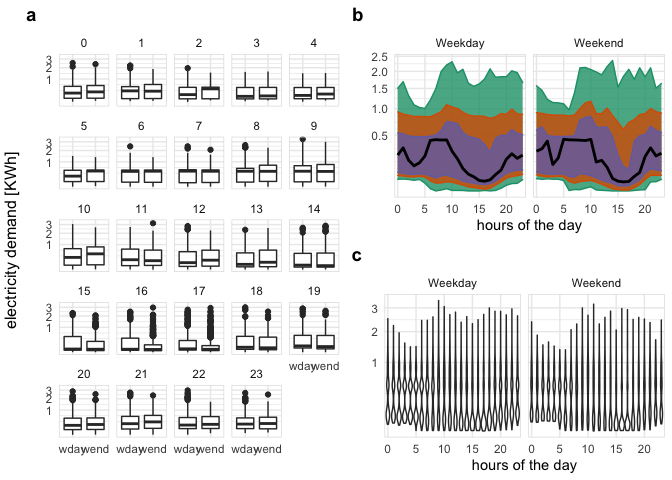

<!-- README.md is generated from README.Rmd. Please edit that file -->

# gravitas

<!-- badges: start -->

[](https://travis-ci.org/Sayani07/gravitas)
[](https://ci.appveyor.com/project/Sayani07/gravitas)
[](https://codecov.io/gh/Sayani07/gravitas?branch=master)

<!-- badges: end -->

## Overview

Package `gravitas` provides a tool to examine the probability
distribution of univariate time series across bivariate temporal
granularities using range of graphics in `ggplot2` through the
following:

  - create multiple-order-up circular or aperiodic temporal
    granularities.

  - categorize pairs of granularities as either *harmony* or *clash*,
    where harmonies are pairs of granularities that aid exploratory data
    analysis, and clashes are pairs that are incompatible with each
    other for exploratory analysis.

  - recommending appropriate probability distribution plots of the time
    series variable across the bivariate granularities based on the
    levels of the bivariate granularties and their interaction.

`gravitas` is not restricted to temporal data. It can be utilized in
non-temporal cases for which a hierarchical structure can be construed
similar to time. The hierarchical structure of time creates a natural
nested ordering. For example, hours are nested within days, days within
weeks, weeks within months, and so on. Similarly, if a periiodic nesting
exist for a non-temporal application, `gravitas` can be used to explore
the probability distribution of a continuous random variable.

## Installation

You can install gravitas from CRAN:

``` r
install.packages("gravitas")  
```

You can install the development version from
[GitHub](https://github.com/) with:

``` r
# install.packages("devtools")
devtools::install_github("Sayani07/gravitas")
```

## Quick look

`gravitas` comes with an interactive webpage, which lets you go through
the different functionalities of this package. To try it, simply use
gravitas::run\_app().

## Features

  - Search for a set of all possible temporal granularities with
    `search_gran()`

  - Build any temporal granularity with `create_gran()`

  - Check if two temporal granularities are harmonies with
    `is_harmony()`

  - Get all possible harmonies with `harmony()`

  - Get recommendations on choosing more appropriate distribution plots
    and advice on interaction between granularities, number of
    observations available for drawing probability distributions for
    chosen granularities with `gran_advice()`

  - Validate if the created granularity matches your already existing
    column with `validate_gran()`

  - Explore probability distribution across bivariate temporal
    granularities with `prob_plot()`

## Example: temporal case

The probability distribution of the energy consumption for ten
households from [customer
trials](https://data.gov.au/dataset/ds-dga-4e21dea3-9b87-4610-94c7-15a8a77907ef/details?q=smart-meter)
can be explored as follows:

### Search for granularities

``` r
library(gravitas)
library(dplyr)
#> Warning: package 'dplyr' was built under R version 3.5.2
library(ggplot2)
#> Warning: package 'ggplot2' was built under R version 3.5.2
library(lvplot)

 smart_meter10 %>%
   search_gran(highest_unit = "week")
#> [1] "hhour_hour" "hhour_day"  "hhour_week" "hour_day"   "hour_week" 
#> [6] "day_week"
```

### Screen harmonies from the search list

``` r
 smart_meter10 %>%
   harmony(
     ugran = "day",
     filter_in = "wknd_wday"
   )
#> # A tibble: 7 x 4
#>   facet_variable x_variable facet_levels x_levels
#>   <chr>          <chr>             <int>    <int>
#> 1 hour_day       hhour_hour           24        2
#> 2 wknd_wday      hhour_hour            2        2
#> 3 wknd_wday      hhour_day             2       48
#> 4 hhour_hour     hour_day              2       24
#> 5 wknd_wday      hour_day              2       24
#> 6 hhour_hour     wknd_wday             2        2
#> 7 hour_day       wknd_wday            24        2
```

### Visualize probability distribution of the harmony pair (wknd\_wday, hour\_day)

Area quantile plots are drawn across hours of the day faceted by
weekend/weekday. The black line represents the median, whereas the
orange and green represents the area between 25th and 75th percentile
and between 10th and 90th percentile respectively. For this household,
median energy consumption for the early morning hours is extremely high
for weekends compared to weekdays. The energy behavior is skewed to the
left, where 10th and 25th percentile are very close to each other in
both weekend/weekday.

``` r
smart_meter10 %>%
 filter(customer_id == 10017936) %>%
   prob_plot(
     gran1 = "wknd_wday",
     gran2 = "hour_day",
     response = "general_supply_kwh",
     plot_type = "quantile",
     quantile_prob = c(0.1, 0.25, 0.5, 0.75, 0.9)) +
   scale_y_sqrt()
```



## Example: non-temporal case

`cricket` data set in the package can be explored by explicitly defining
a hierarchy table as follows:

#### Visualize granularities for non-temporal data

Each inning of the match is plotted across facets and overs of the
innings are plotted across the x-axis. It can be observed from the
letter value plot that there is no clear upward shift in runs in the
second innings as compared to the first innings. The variability in runs
increase as the teams approach towards the end of the innings, as
observed through the longer and more distinct letter values.

``` r
library(tsibble)
#> Warning: package 'tsibble' was built under R version 3.5.2
#> 
#> Attaching package: 'tsibble'
#> The following object is masked from 'package:dplyr':
#> 
#>     id
cricket_tsibble <- cricket %>%
 mutate(data_index = row_number()) %>%
 as_tsibble(index = data_index)

 hierarchy_model <- tibble::tibble(
   units = c("index", "ball", "over", "inning", "match"),
   convert_fct = c(1, 6, 20, 2, 1)
 )
 cricket_tsibble %>%
   create_gran(
     "ball_over",
     hierarchy_model
   )
#> # A tsibble: 8,560 x 12 [1]
#>    season match_id batting_team bowling_team inning  over wicket dot_balls
#>     <dbl>    <dbl> <chr>        <chr>         <dbl> <dbl>  <dbl>     <dbl>
#>  1   2008        2 Chennai Sup… Kings XI Pu…      1     1      0         4
#>  2   2008        2 Chennai Sup… Kings XI Pu…      1     2      0         2
#>  3   2008        2 Chennai Sup… Kings XI Pu…      1     3      1         4
#>  4   2008        2 Chennai Sup… Kings XI Pu…      1     4      0         3
#>  5   2008        2 Chennai Sup… Kings XI Pu…      1     5      0         3
#>  6   2008        2 Chennai Sup… Kings XI Pu…      1     6      0         3
#>  7   2008        2 Chennai Sup… Kings XI Pu…      1     7      1         1
#>  8   2008        2 Chennai Sup… Kings XI Pu…      1     8      1         3
#>  9   2008        2 Chennai Sup… Kings XI Pu…      1     9      0         1
#> 10   2008        2 Chennai Sup… Kings XI Pu…      1    10      0         2
#> # … with 8,550 more rows, and 4 more variables: runs_per_over <dbl>,
#> #   run_rate <dbl>, data_index <int>, ball_over <fct>

   cricket_tsibble %>%
   filter(batting_team %in% c("Mumbai Indians",
                              "Chennai Super Kings"))%>%
   prob_plot("inning", "over",
   hierarchy_model,
   response = "runs_per_over",
   plot_type = "lv")
```


## More information

View the [vignette](https://sayani07.github.io/gravitas/) to get
started\!

This package takes tsibble as the data input. Tsibble provides a data
class of tbl\_ts to represent tidy temporal data. It consists of a time
index, key and other measured variables in a data-centric format, which
makes it easier to work with temporal data. To learn more about it,
please visit <https://tsibble.tidyverts.org/>

## Acknowledgements

Thanks to PhD supervisors [Prof. Rob J
Hyndman](https://robjhyndman.com/), [Prof. Dianne
Cook](http://dicook.org/) and [Google Summer of
Code 2019](https://summerofcode.withgoogle.com/) mentor [Prof. Antony
Unwin](http://rosuda.org/~unwin/) for their support and always leading
by example. The fine balance of encouraging me to work on my ideas and
stepping in to help when I need has made the devlopment of this package
a great learning experience for me.

Moreover, I want to thank my cohort at
[NUMBATS](https://www.monash.edu/news/articles/team-profile-monash-business-analytics-team),
Monash University for always lending an ear and sharing their wisdom and
experience of developing R packages whenever needed.

## Reporting and issues

Please submit all bug reports, errors, and feature requests to
<https://github.com/Sayani07/gravitas/issues>
