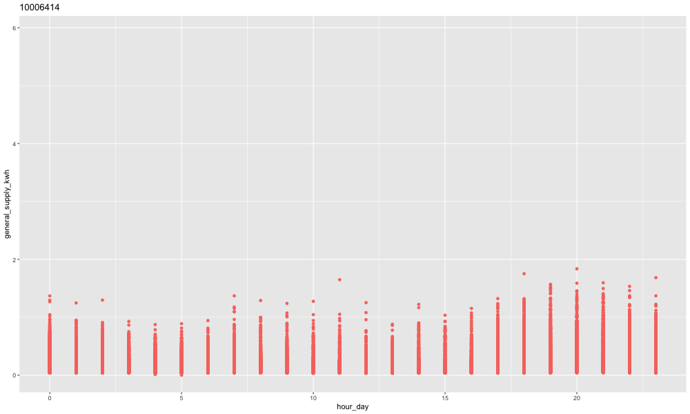

<!-- #Example vignette: 
https://github.com/njtierney/naniar/blob/master/vignettes/getting-started-w-naniar.Rmd -->
```{r setup, include = FALSE}
knitr::opts_chunk$set(
  echo = TRUE,
  collapse = TRUE,
  comment = "#>",
  fig.height = 5,
  fig.width = 8,
  fig.align = "center",
  cache = FALSE
)
library(gravitas)
library(dplyr)
library(ggplot2)
library(tsibble)

```


# Introduction

Temporal data are available at various resolution depending on the context. Often in time series analysis, data collected at finer scale needs to be explored also at coarser temporal scales. This approach requires deconstructing time in various possible ways leading to linear (e.g. days, weeks), circular (e.g. day-of-week) or aperiodic (e.g. day-of-month) time granularities. The hierarchical structure of time also creates a natural nested ordering resulting in single or multiple order-up granularities. For a conventional Gregorian calendar, examples of single-order-up granularity may include hour-of-day, minute-of-hour and examples of multiple-order-up granularity may include hour-of-week or minute-of-day. All of these granularites might be useful in throwing light on the periodicity of the data.  


Exploration of large quantities of temporal data across so many different deconstructions of time becomes clumsy without a systematic approach. 

This vignette describes the tools in the package `gravitas` for systematically exploring large quantities of temporal data across different time deconstructions by visualizing the probability distributions using range of graphics in `ggplot2`.

# Analysis of smart meter data

The `smart_meter10` data set in the package is a [tsibble](https://tsibble.tidyverts.org/) providing the energy consumption for ten households from [customer trials](https://data.gov.au/dataset/ds-dga-4e21dea3-9b87-4610-94c7-15a8a77907ef/details?q=smart-meter). 


```{r data_look}
smart_meter10 %>% select(customer_id,
                         reading_datetime,
                         general_supply_kwh,
                         everything()
)
```

To have an understanding of how different the energy consumption for each household of the trial is, energy consumption is plotted against time with each transition state indicating one household for a sample. If we plot the raw data for all of them, it is difficult to get insights of their behavior. 


```{r, echo=FALSE, out.width="100%"}
# smart_p <- smart_meter10 %>%
#            ggplot() + 
#            geom_line(aes(x =reading_datetime,
#                          y = general_supply_kwh, 
#                          color = customer_id))  + 
#   theme(legend.position = "None")
# 
# smart_anim <-  smart_p + gganimate::transition_states(customer_id)+ labs(title = "{closest_state}")
# 
# gganimate::animate(smart_anim, fps = 10, width = 1000, height = 600)
# 
# 
# anim_save("images/smart_allcust.gif")

knitr::include_graphics("man/figures/smart_allcust.gif")
```


Things become harder when we try to visualize periodicity in the data for all households. For example, if we plot the energy consumption across each hour of the day, the structure of the data suggest that there are several data points for each hour of the day for just one household. Hence, for several households, there will be a blob of points for each hour of the day. 

```{r, echo=FALSE, out.width="100%"}
# smart_p <- smart_meter10 %>%
#            ggplot() + 
#            geom_line(aes(x =reading_datetime,
#                          y = general_supply_kwh, 
#                          color = customer_id))  + 
#   theme(legend.position = "None")
# 
# smart_anim <-  smart_p + gganimate::transition_states(customer_id)+ labs(title = "{closest_state}")
# 
# gganimate::animate(smart_anim, fps = 10, width = 1000, height = 600)
# 
# 
# anim_save("images/smart_allcust.gif")


```


So the question is how to explore systematically multiple perspectives of this smart meter data across different time granularities? The solution is to visualize the probability distributions across these granularities to find regular / nearly-periodic patterns or anomalies in behaviors.

Let us see how we can analyze the energy behavior of these households by making allowances for the following aspects of time granularities: Computation, interaction and visualisation. 


## Computation

### Get set of possible granularities with `search_gran`

Typically, the first thing we should have at our disposal for examining periodicities of energy behavior across time granularities is to know the number of time granularities we can look at exhaustively. If we consider conventional time deconstructions for a Gregorian calendar (second, minute, half-hour, hour, day, week, fortnight, month, quarter, semester, year), the following time granularities can be considered for this analysis. 


```{r search_gran}
library(tsibble)
interval(smart_meter10)
smart_meter10 %>% search_gran()
```

The interval of this tsibble is 30 minutes, and hence the default for `search_gran` in this case, provides temporal granularities ranging from half-hour to year. If these options are considered too many, the default options can be modified to limit the possibilities. For example, the most coarse temporal unit can be set to be a "month".

```{r search_gran_limit}

smart_meter10 %>% 
  search_gran(highest_unit = "month")
```

This looks better. However, some intermediate temporal units might not be pertinent to the analysis and we might want to remove them from the list of granularities that we want to examine using the argument `filter_out` in `search_gran`.

```{r search_gran_limit2}

smart_meter10 %>% search_gran(ugran = "month",
                              filter_out = c("hhour", "fortnight")
)
```

### Create any temporal granularity with `create_gran()`

After we have the set of granularities to look at, we should be able to compute any granularity using `create_gran`. These can be be used for exploring distribution of the time series across univariate temporal granularity or computing summary statistics across these categorizations. 

The data is filtered for two customers and a new granularity "day-of-the-fortnight" is created and visualised to understand if the electricity demand consumption is different across days of the fortnight. From the [letter value plot](https://amstat.tandfonline.com/doi/abs/10.1080/10618600.2017.1305277?journalCode=ucgs20#.XbOwLpMzZ24), we can not clearly observe any pattern across days of the fortnight for each individual household. But we can see the difference in distribution of 
energy consumption for these two households. Let us see if we can derive any other insights than the othewrwise obvious observation that for most cases the second household has much less consumption than the first one. If we consider letter value F as a regular behavior and letter values beyond F as not-so-regular behavior, we can conclude that the regular behavior of the first household is more stable than the second household. However, the distribution of tail of the first household is more variable reflected through distinct letter values, implying when their not-so-regular behavior is quite extreme. 

```{r}
library(lvplot)
library(ggplot2)
library(dplyr)
library(tibble)
smart_meter10 %>%
  filter(customer_id %in% c(10006704, 10017936)) %>% 
  create_gran("day_fortnight") %>%
  ggplot2::ggplot(aes(
    x = as.factor(day_fortnight),
    y = general_supply_kwh)) +
  xlab("day_fortnight") +
  geom_lv(
    outlier.colour = "red",
    aes(fill = ..LV..),
    k = 5) +
  facet_wrap(~customer_id) + 
  scale_fill_lv() +
  theme_bw() +
  scale_y_sqrt() 

```

## Interaction

We can visualise the distribution of energy across univariate time granularities for deriving insights on periodic behavior. From the search list, we found that we can look at six granularities, that amounts to analyzing six graphics. However, what happens if we want to see the distribution of energy across two granularities at a time? This is equivalent to looking at the distribution of energy consumption across one granularity conditional on another one. One way can be to plot one of the granularities on the x-axis and another on the facet. Different perspectives of the data can be derived by placing time granularity across x-axis and facets.   

So, what is the number of pairs of granularities we can look at? It is equivalent to taking 2 granularities from 6, which essentially means we need to examine 30 plots. The good news is, not all time granularities can be plotted together and we do not have to analyse so many plots!

Harmony/clash can be identified to considerably reduce the number of visualizations that can aid exploratory analysis.

```{r is_harmony}
smart_meter10 %>% 
  is_harmony(gran1 = "hour_day", 
             gran2 = "day_week")

smart_meter10 %>%
  is_harmony(gran1 = "hour_day", 
             gran2 = "day_week", 
             facet_h = 14)

smart_meter10 %>% 
  is_harmony(gran1 = "day_month",
             gran2 = "week_month")
```

Let us now look at all the harmonies that we can examine. Fortunately, we are left with only 13 out of 30 visualizations. We can also play with the argument `facet_h`, which represents the maximum number of levels allowed for facet variables, to reduce or increase the number of harmonies.

```{r harmony, echo=TRUE}
smart_meter10 %>% harmony(
  ugran = "month",
  filter_out = c("hhour")
)
```


## Visualization

We want to visualize distribution of the measured variable `general_supply_kwh` across these harmonies through different distribution plots using `prob_plot`. We have several options for visualizing statistical distributions and each comes with some pros and cons which we need to consider while choosing a good one for our context. Traditional methods of plotting distributions include boxplots and violin plots, while more recent methods include ridge plots, quantile plots or letter-value plots. 

`gran_advice` provides check points before plotting a distribution. It includes recommended distribution plots depending on the levels of the two granularities plotted. Assumptions are made to ensure display is not too cluttered by the space occupied by various kinds of distribution plots. Moreover, it also advices on the number 
of observations used for drawing the distribution plot so that one can ensure that they are enough before jumping on to plot a distribution. Furthermore, it advices if the number of observations varies significantly across facets or within facets.

```{r granadvice}
smart_meter10 %>% gran_advice(
  "week_month",
  "wknd_wday"
)
```


`gran_obs` can be employed to see if number of observations per category is large enough to draw distribution plot. In this case, number of observations are much less on weekends compared to weekdays, but enough to have reliable estimates of distribution.

```{r granobs, echo=TRUE}
smart_meter10 %>% gran_obs(
  "week_month",
  "wknd_wday"
)
```

Through `prob_plot` we can choose one from the list of recommended plots. Warnings are generated if users try to plot clashes, number of facet variables are too high or number of observations used to compute statistical summaries for distribution are not large enough.


Currently, we can choose from "boxplot", "violin", "ridge", "lv" or "quantile" to visualize distributions.


The quantile plot of energy consumption across day-month (x-axis) and hour-day (facet). This will help us to see if for each hour of the day, energy consumption changes across different days of the month. From the plot, we see there is not much variation across day-of-month. 


```{r hd_dm, echo=TRUE, fig.cap="Quantile plot across hour-day as facets and day-month across x-axis"}
smart_meter10 %>%
  prob_plot("hour_day",
    "day_month",
    response = "general_supply_kwh",
    plot_type = "quantile",
    quantile_prob = c(0.1, 0.25, 0.5, 0.75, 0.9),
    symmetric = TRUE
  ) +
  scale_y_sqrt()
```


Moving on, if we want to switch the facet and x-axis variable, we simply reverse the order of time granularities. Here, prob_plot would output a ggplot2 object. So we are free to add any element to the default plot. \ref{fig:dm_hd} shows quantile plot of energy consumption across day-month (facet) and hour-day (x-axis). This plot shows the daily pattern of consumption for each day of the month. There is a morning and evening peak in consumption.


```{r dm_hd, echo=TRUE}
smart_meter10 %>%
  prob_plot("day_month",
    "hour_day",
    response = "general_supply_kwh",
    plot_type = "quantile",
    quantile_prob = c(0.1, 0.25, 0.5, 0.75, 0.9),
    symmetric = TRUE
  )
```

\ref{fig:dw_hd} shows letter-value plot of energy consumption across wknd_wday (facet) and hour-day (x-axis).
On weekdays, letter value C (lower tail) from 7 hours to 16 hours is not distinctly visible for most hours on weekdays compared to weekends, signifying there might be less volatility in these hours for weekdays.  Similar observations can be made for letter values C and D which closely follow M, F, E on weekdays, but not on weekends.


```{r hd_dw, echo=TRUE}
cust1 <- smart_meter10 %>% 
  filter(customer_id %in% c(10006704)) %>% 
  prob_plot("wknd_wday",
                            "hour_day",
                            response = "general_supply_kwh",
                            plot_type = "lv") +
  scale_y_sqrt()
```

```{r hd_dw, echo=TRUE}
cust2 <- smart_meter10 %>% 
  filter(customer_id %in% c(10017936))%>% 
  prob_plot("wknd_wday",
                            "hour_day",
                            response = "general_supply_kwh",
                            plot_type = "lv") +
  scale_y_sqrt()
```

```{r cust, echo=TRUE}
cust1
cust2
```

## Further work

To develop a framework so that these individual distributions are utilizes to group customers into similar pockets of behavior. 

## Acknowledgements

Thanks to PhD supervisors [Prof. Rob J Hyndman](https://robjhyndman.com/), [Prof. Dianne Cook](http://dicook.org/) and [Google Summer of Code 2019](https://summerofcode.withgoogle.com/) mentor [Prof. Antony Unwin](http://rosuda.org/~unwin/) for their support and always leading by example. The fine balance of encouraging me to work on my ideas and stepping in to help when I need has made the devlopment of this package a great learning experience for me.

Moreover, I want to thank my cohort at [NUMBATS](https://www.monash.edu/news/articles/team-profile-monash-business-analytics-team) at Monash University for always lending an ear and sharing their wisdom and experience on developing R packages whenever needed. 


